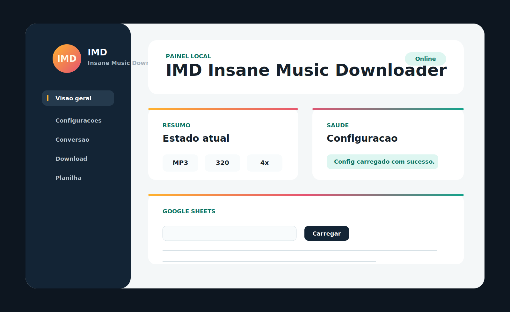

<div align="center">

# IMD — Insane Music Downloader

Painel local para importar listas, localizar faixas, baixar áudio, converter formatos e organizar uma biblioteca de músicas no Windows.

[](https://github.com/rafabios/imd/releases/latest)
[](https://github.com/rafabios/imd/actions/workflows/build-msi.yml)
[](LICENSE)

[Site e manual](https://imd.vemcompy.tec.br/) · [Baixar Setup.exe](https://github.com/rafabios/imd/releases/latest/download/IMD-Insane-Music-Downloader-latest-Setup.exe) · [Todas as releases](https://github.com/rafabios/imd/releases)

</div>



## O que é o IMD

O IMD roda no próprio computador e abre uma interface em `http://127.0.0.1:8765`. Ele recebe links ou listas de músicas, consulta informações públicas do Spotify, pesquisa as faixas no YouTube com `yt-dlp`, usa FFmpeg para processar o áudio e registra o histórico para evitar downloads repetidos.

### Principais recursos

- atalhos para **Download Spotify**, **Download YouTube** e **Pasta de Músicas**;
- importação de Google Sheets, CSV, TXT e XLSX;
- pré-visualização e seleção das faixas antes do download;
- acompanhamento de tarefas e logs em tempo real;
- cancelamento de downloads e encerramento dos subprocessos relacionados;
- reescaneamento de playlists sem baixar novamente o que já existe;
- conversão em lote entre MP3, M4A, MP4, FLAC, WAV, OGG, OPUS e AAC;
- preenchimento de metadados e miniaturas quando habilitado;
- histórico de sucessos, falhas e tentativas;
- atualização diária isolada do `yt-dlp` no aplicativo empacotado.

## Instalação no Windows

### Opção recomendada: Setup.exe

1. Acesse a [última release](https://github.com/rafabios/imd/releases/latest).
2. Baixe `IMD-Insane-Music-Downloader-latest-Setup.exe`.
3. Siga o assistente para escolher as pastas e, opcionalmente, a planilha do Google.
4. Abra o IMD pelo atalho criado no menu Iniciar ou na área de trabalho.

O instalador funciona por usuário, não exige Python e inclui as dependências principais e o FFmpeg. Atualizações preservam o `config.yaml` existente.

Se o Windows impedir a execução, consulte o guia com imagens em [Problemas comuns na instalação](https://imd.vemcompy.tec.br/#problems).

### Opção técnica: MSI

O arquivo `IMD-Insane-Music-Downloader-latest.msi` é mantido para instalação silenciosa, automação e administração de máquinas Windows.

## Primeiros passos

1. Abra o painel do IMD.
2. Use um dos atalhos de download ou carregue uma planilha/lista.
3. Confira as faixas encontradas.
4. Ajuste formato, qualidade e demais opções em **Configurações**.
5. Inicie o download e acompanhe o log na tela.

Os arquivos são salvos em `paths.music_dir`. Histórico, cache e falhas ficam em `paths.state_dir`.

## Entradas aceitas

- playlist pública do Spotify;
- artista público do Spotify;
- link direto do YouTube;
- texto de pesquisa para o YouTube;
- Google Sheets publicado como CSV;
- arquivos locais `.csv`, `.txt` e `.xlsx`.

## Configuração

O arquivo [`config.sample.yaml`](config.sample.yaml) documenta todas as opções disponíveis. Para executar pelo código-fonte, copie-o para `config.yaml` e ajuste pelo menos:

```yaml
source:
  google_sheet_csv: "https://docs.google.com/spreadsheets/d/SEU_ID/export?format=csv&gid=0"

paths:
  music_dir: "C:/Users/SEU_USUARIO/Music/IMD"
  state_dir: "C:/Users/SEU_USUARIO/Music/IMD-State"

audio:
  format: "mp3"
  quality: 320

spotify:
  mode: "EMBED"
```

Modos do Spotify:

- `EMBED`: lê informações públicas e segue com as pesquisas no YouTube;
- `INDEX_ONLY`: apenas indexa as faixas encontradas;
- `YOUTUBE_ONLY`: ignora a extração do Spotify;
- `OFF`: desativa o processamento de links Spotify.

## Limitações conhecidas

- O endpoint público incorporado do Spotify pode retornar somente parte de playlists grandes, frequentemente as primeiras 50 faixas. O IMD avisa quando isso pode ter acontecido e não marca a playlist como definitivamente concluída.
- Resultados e disponibilidade do YouTube variam por região, idade, conta e alterações no próprio serviço.
- O IMD não remove DRM nem concede direitos sobre conteúdo. Use-o somente com mídias que você tem autorização para acessar, baixar ou converter.

## Executar pelo código-fonte

Recomendado: Windows e Python 3.12.

```powershell
py -3.12 -m venv .venv
.\.venv\Scripts\python.exe -m pip install -r requirements.txt
Copy-Item config.sample.yaml config.yaml
.\.venv\Scripts\python.exe imd_launcher.py
```

O `imd_launcher.py` prepara o ambiente, verifica o `yt-dlp`, inicia o servidor local e abre o navegador automaticamente.

## Testes

```powershell
.\.venv\Scripts\python.exe -m pytest -q
.\.venv\Scripts\python.exe -m py_compile app_server.py music_downloader.py imd_launcher.py
```

## Gerar uma release Windows

O workflow [`build-msi.yml`](.github/workflows/build-msi.yml) executa os testes e gera o aplicativo portátil, Setup EXE, MSI e `SHA256SUMS.txt`.

```bash
git tag vX.Y.Z
git push origin vX.Y.Z
```

Tags `v*` publicam os instaladores na página de releases. O workflow também pode ser iniciado manualmente em **Actions → Build Windows Installers**.

## Docker

Crie `config.docker.yaml` a partir de `config.sample.yaml` e use caminhos Linux:

```yaml
paths:
  music_dir: "/music"
  state_dir: "/state"
```

```bash
docker build -t imd:latest .
docker run --rm -it \
  -v "$(pwd)/config.docker.yaml:/app/config.yaml:ro" \
  -v "$(pwd)/music:/music" \
  -v "$(pwd)/state:/state" \
  imd:latest
```

## Estrutura do projeto

| Caminho | Responsabilidade |
|---|---|
| `music_downloader.py` | Spotify, pesquisas, downloads, conversão, tags e histórico |
| `app_server.py` | API HTTP, arquivos importados e gerenciamento de tarefas |
| `imd_launcher.py` | Inicialização do painel e atualização isolada do `yt-dlp` |
| `web/` | Interface local do aplicativo |
| `docs/` | Site, manual e GitHub Pages |
| `packaging/` | PyInstaller, WiX e Inno Setup |
| `tests/` | Testes automatizados |

## Privacidade e segurança

- O painel escuta apenas em `127.0.0.1` por padrão.
- Requisições externas de alteração são rejeitadas pela API local.
- O IMD não envia sua biblioteca ou histórico para um servidor próprio.
- Downloads dependem dos serviços configurados e das requisições feitas pelo usuário.

## Licença

Distribuído sob a [GNU General Public License v3.0](LICENSE).
