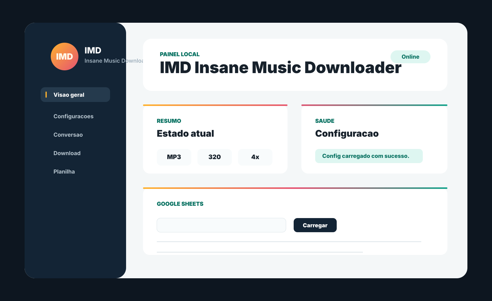

<div align="center">

# IMD — Insane Music Downloader

Painel local para importar listas, localizar faixas, baixar áudio, converter formatos e organizar uma biblioteca de músicas no Windows e no macOS.

[](https://github.com/rafabios/imd/releases/latest)
[](https://github.com/rafabios/imd/actions/workflows/build-msi.yml)
[](https://github.com/rafabios/imd/actions/workflows/build-macos.yml)
[](LICENSE)

[Site e manual](https://imd.vemcompy.tec.br/) · [Baixar para Windows](https://github.com/rafabios/imd/releases/latest/download/IMD-Insane-Music-Downloader-latest-Setup.exe) · [Baixar para macOS](https://github.com/rafabios/imd/releases/latest) · [Todas as releases](https://github.com/rafabios/imd/releases)

</div>



## O que é o IMD

O IMD roda no próprio computador e abre uma interface em `http://127.0.0.1:8765`. Ele recebe links ou listas de músicas, consulta informações públicas do Spotify, pesquisa as faixas no YouTube com `yt-dlp`, usa FFmpeg para processar o áudio e registra o histórico para evitar downloads repetidos.

### Principais recursos

- atalhos para **Download Spotify**, **Download YouTube**, **Tagear Músicas** e **Pasta de Músicas**;
- importação de Google Sheets, CSV, TXT e XLSX;
- pré-visualização e seleção das faixas antes do download, incluindo todas as linhas, linhas filtradas ou números e intervalos específicos;
- acompanhamento de tarefas e logs em tempo real;
- cancelamento de downloads e encerramento dos subprocessos relacionados;
- reescaneamento de playlists sem baixar novamente o que já existe;
- conversão em lote entre MP3, M4A, MP4, FLAC, WAV, OGG, OPUS e AAC;
- preenchimento de metadados e miniaturas quando habilitado;
- comparação de vários candidatos do YouTube, priorizando fontes oficiais e a melhor qualidade disponível antes do download;
- análise técnica da biblioteca ou de arquivos arrastados, com bitrate, taxa de amostragem, loudness, true peak, faixa dinâmica e classificação Boa, Média ou Ruim;
- histórico de sucessos, falhas e tentativas;
- atualização diária isolada do `yt-dlp` no aplicativo empacotado.

## Instalação no Windows

### Opção recomendada: Setup.exe

1. Acesse a [última release](https://github.com/rafabios/imd/releases/latest).
2. Baixe `IMD-Insane-Music-Downloader-latest-Setup.exe`.
3. Siga o assistente e confirme a pasta onde as músicas serão salvas.
4. Abra o IMD pelo atalho criado no menu Iniciar ou na área de trabalho.

O instalador funciona por usuário, não exige Python e inclui as dependências principais e o FFmpeg. Ele usa a pasta **Músicas** real configurada no Windows, guarda histórico/cache internamente em `AppData\Local` e deixa a planilha para ser configurada no painel. Atualizações preservam o `config.yaml`; quando encontram o antigo caminho padrão `Music\IMD-State`, copiam o histórico para a nova pasta interna e mantêm a pasta antiga como segurança. Caminhos personalizados não são alterados.

Se o Windows impedir a execução, consulte o guia com imagens em [Problemas comuns na instalação](https://imd.vemcompy.tec.br/#problems).

### Opção técnica: MSI

O arquivo `IMD-Insane-Music-Downloader-latest.msi` é mantido para instalação silenciosa, automação e administração de máquinas Windows.

## Instalação no macOS

Há dois pacotes sem certificado Apple Developer e sem notarização:

- `IMD-Insane-Music-Downloader-latest-macOS-Apple-Silicon.dmg` para Macs com chips Apple M1, M2, M3, M4 ou posteriores;
- `IMD-Insane-Music-Downloader-latest-macOS-Intel.dmg` para Macs Intel.

Abra o DMG e arraste `IMD.app` para **Aplicativos**. Como o pacote não é notarizado, o macOS pode bloquear a primeira abertura. Depois de tentar abrir o app uma vez, acesse **Ajustes do Sistema → Privacidade e Segurança → Abrir Mesmo Assim** e confirme em **Abrir**.

Se ainda for necessário e você tiver conferido a origem e o SHA256 publicado na release, use:

```bash
xattr -dr com.apple.quarantine "/Applications/IMD.app"
open "/Applications/IMD.app"
```

Não é necessário desativar o Gatekeeper globalmente. O aplicativo inclui Python, dependências e FFmpeg; configurações ficam em `~/Library/Application Support/IMD Insane Music Downloader`.

## Primeiros passos

1. Abra o painel do IMD.
2. Use um dos atalhos de download ou carregue uma planilha/lista.
3. Confira as faixas encontradas.
4. Ajuste formato, qualidade e demais opções em **Configurações**.
5. Inicie o download e acompanhe o log na tela.

Os arquivos são salvos na pasta de músicas escolhida. Histórico, cache e falhas ficam em uma pasta interna do usuário e não precisam de configuração manual.

Em **Configurações**, você pode colar o link comum de uma planilha do Google ou usar **Criar nova no Google**. O botão abre `sheets.new` na conta já conectada ao navegador. Depois, compartilhe a planilha como **Qualquer pessoa com o link**, copie o endereço e salve no IMD; o app converte o link para CSV automaticamente. Criar e acessar uma planilha privada diretamente pelo app exigiria OAuth, por isso esse fluxo não pede acesso à sua conta Google.

Na tela **Planilha**, use `Selecionar todas`, `Selecionar filtradas` ou informe combinações como `1, 3-5, 9`. Na tela **Download**, o campo **Linhas da planilha** aceita a mesma sintaxe; deixe vazio ou use `todos` para processar a lista inteira. O atalho **Tagear Músicas** preenche os metadados ausentes da biblioteca configurada sem iniciar novos downloads.

Na tela **Análise de Música**, a nota prioriza a qualidade técnica do arquivo: formatos sem perdas, bitrate e taxa de amostragem. Para arquivos com perdas, 192 kbps ou mais é considerado adequado e 256 kbps ou mais, alto; 44,1 kHz ou mais é a taxa esperada. Loudness entre -20 e -5 LUFS é tratada como faixa usual do perfil de música do IMD. True peak próximo ou acima de 0 dBTP gera um alerta de nível/masterização, mas não transforma sozinho um arquivo bem codificado em **Ruim**. Esses limites são uma heurística prática, não uma prova da origem da gravação nem da qualidade artística.

Nos downloads do YouTube, o IMD compara candidatos de todas as consultas configuradas, favorece canais oficiais, Topic e VEVO, penaliza versões não solicitadas e inspeciona os formatos de áudio antes de escolher. Após baixar, uma verificação espectral rápida procura cortes rígidos suspeitos; quando encontra um e há alternativas, tenta automaticamente o próximo candidato. Se todas as fontes tiverem limitações, preserva a melhor delas. O log mostra separadamente a fonte recebida e a saída convertida; por exemplo, `Opus ~157 kbps -> MP3 320 kbps`. O MP3 final será compatível com a qualidade configurada, mas a conversão não recria detalhes ausentes na fonte original.

## Entradas aceitas

- playlist pública do Spotify;
- artista público do Spotify;
- link direto do YouTube;
- texto de pesquisa para o YouTube;
- Google Sheets compartilhado por link ou publicado como CSV;
- arquivos locais `.csv`, `.txt` e `.xlsx`.

## Configuração

O arquivo [`config.sample.yaml`](config.sample.yaml) documenta todas as opções disponíveis. Para executar pelo código-fonte, copie-o para `config.yaml` e ajuste pelo menos:

```yaml
source:
  google_sheet_csv: ""

paths:
  music_dir: "C:/Users/SEU_USUARIO/Music/IMD"

audio:
  format: "mp3"
  quality: 320

spotify:
  mode: "EMBED"
```

No app instalado, `paths.state_dir` é preenchido automaticamente dentro dos dados locais do usuário. O campo continua existindo no arquivo para compatibilidade e uso avançado, mas fica oculto no painel.

Modos do Spotify:

- `EMBED`: lê informações públicas e segue com as pesquisas no YouTube;
- `INDEX_ONLY`: apenas indexa as faixas encontradas;
- `YOUTUBE_ONLY`: ignora a extração do Spotify;
- `OFF`: desativa o processamento de links Spotify.

## Limitações conhecidas

- O endpoint público incorporado do Spotify pode retornar somente parte de playlists grandes, frequentemente as primeiras 50 faixas. O IMD avisa quando isso pode ter acontecido e não marca a playlist como definitivamente concluída.
- Resultados e disponibilidade do YouTube variam por região, idade, conta e alterações no próprio serviço.
- O IMD não remove DRM nem concede direitos sobre conteúdo. Use-o somente com mídias que você tem autorização para acessar, baixar ou converter.

## Executar pelo código-fonte

Recomendado: Python 3.12 no Windows ou macOS.

```powershell
py -3.12 -m venv .venv
.\.venv\Scripts\python.exe -m pip install -r requirements.txt
Copy-Item config.sample.yaml config.yaml
.\.venv\Scripts\python.exe imd_launcher.py
```

O `imd_launcher.py` prepara o ambiente, verifica o `yt-dlp`, inicia o servidor local e abre o navegador automaticamente.

## Testes

```powershell
.\.venv\Scripts\python.exe -m pytest -q
.\.venv\Scripts\python.exe -m py_compile app_server.py music_downloader.py imd_launcher.py audio_analysis.py
```

## Gerar uma release

O workflow [`build-msi.yml`](.github/workflows/build-msi.yml) executa os testes e gera o aplicativo portátil, Setup EXE, MSI e `SHA256SUMS.txt`.

O workflow [`build-macos.yml`](.github/workflows/build-macos.yml) gera DMGs separados para Intel e Apple Silicon, executa o `.app`, valida o FFmpeg incorporado e publica os hashes SHA256.

```bash
git tag vX.Y.Z
git push origin vX.Y.Z
```

Tags `v*` executam as duas pipelines e publicam os instaladores na página de releases. Cada workflow também pode ser iniciado manualmente na aba **Actions**.

## Docker

Crie `config.docker.yaml` a partir de `config.sample.yaml` e use caminhos Linux:

```yaml
paths:
  music_dir: "/music"
  state_dir: "/state"
```

```bash
docker build -t imd:latest .
docker run --rm -it \
  -v "$(pwd)/config.docker.yaml:/app/config.yaml:ro" \
  -v "$(pwd)/music:/music" \
  -v "$(pwd)/state:/state" \
  imd:latest
```

## Estrutura do projeto

| Caminho | Responsabilidade |
|---|---|
| `music_downloader.py` | Spotify, pesquisas, downloads, conversão, tags e histórico |
| `audio_analysis.py` | Análise técnica de loudness, pico real e qualidade dos arquivos de áudio |
| `app_server.py` | API HTTP, arquivos importados e gerenciamento de tarefas |
| `imd_launcher.py` | Inicialização do painel e atualização isolada do `yt-dlp` |
| `web/` | Interface local do aplicativo |
| `docs/` | Site, manual e GitHub Pages |
| `packaging/` | PyInstaller, WiX, Inno Setup e bundle macOS |
| `tests/` | Testes automatizados |

## Privacidade e segurança

- O painel escuta apenas em `127.0.0.1` por padrão.
- Requisições externas de alteração são rejeitadas pela API local.
- O IMD não envia sua biblioteca ou histórico para um servidor próprio.
- Downloads dependem dos serviços configurados e das requisições feitas pelo usuário.

## Licença

Distribuído sob a [GNU General Public License v3.0](LICENSE).
